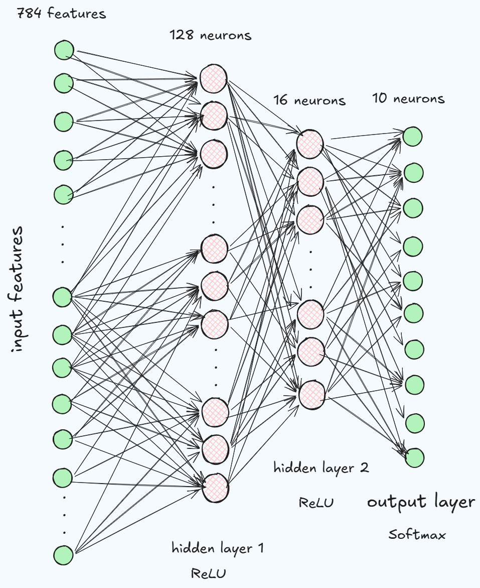

# Building a Simple ANN with PyTorch for Fashion MNIST Classification

This notebook demonstrates how to build and train a simple Artificial Neural Network (ANN) using PyTorch for classifying images from the Fashion MNIST dataset. It covers data loading, preprocessing, model definition, training, and evaluation, including considerations for GPU acceleration.

## Table of Contents

- [Overview](#overview)
- [Dataset](#dataset)
- [Preprocessing](#preprocessing)
- [Model Architecture](#model-architecture)
- [Training](#training)
- [Evaluation](#evaluation)
- [Usage](#usage)

## Overview

This project aims to classify fashion items from the Fashion MNIST dataset using a feed-forward neural network implemented in PyTorch. The notebook is structured to walk through each step of a typical machine learning workflow, from data preparation to model training and performance assessment.

## Dataset

The dataset used is **Fashion MNIST**, a dataset of Zalando's article images—consisting of a training set of 60,000 examples and a test set of 10,000 examples. Each example is a 28x28 grayscale image, associated with a label from 10 classes.

The dataset is loaded using `torchvision.datasets.FashionMNIST`.

- **Training Samples**: 48,000
- **Test Samples**: 12,000
- **Image Size**: 28x28 pixels (flattened to 784 features)
- **Number of Classes**: 10 (e.g., T-shirt/top, Trouser, Pullover, Dress, Coat, Sandal, Shirt, Sneaker, Bag, Ankle boot)

## Preprocessing

1.  **Data Loading**: Fashion MNIST is loaded using `torchvision`.
2.  **Flattening**: 28x28 images are flattened into a 1D vector of 784 features.
3.  **Train-Test Split**: The dataset is split into 80% training and 20% testing sets using `sklearn.model_selection.train_test_split`.
4.  **Scaling**: Pixel values are scaled from `[0, 255]` to `[0, 1]` by dividing by 255.0.
5.  **Custom Dataset and DataLoader**: A `CustomDataset` class is defined to handle features and labels, converting them to PyTorch tensors. `DataLoader` objects are then created to efficiently batch and load data during training and evaluation.

## Model Architecture

The model `MyNN` is a simple Artificial Neural Network (ANN) defined using `torch.nn.Module` and `torch.nn.Sequential`. It consists of:

-   An input layer of `784` features (from the flattened 28x28 images).
-   A hidden layer with `128` neurons and ReLU activation.
-   Another hidden layer with `64` neurons and ReLU activation.
-   An output layer with `10` neurons (corresponding to the 10 classes) and no explicit softmax activation, as `nn.CrossEntropyLoss` includes it internally.

## Training

-   **Device**: The training utilizes a GPU if available (`cuda`), otherwise falls back to CPU.
-   **Epochs**: The model is trained for 100 epochs.
-   **Learning Rate**: Set to `0.1`.
-   **Loss Function**: `nn.CrossEntropyLoss` is used, which is suitable for multi-class classification.
-   **Optimizer**: Stochastic Gradient Descent (`optim.SGD`) is used.
-   **Batch Size**: 32

The training loop includes moving data to the GPU for accelerated computation.

## Evaluation

After training, the model's performance is evaluated on both the test and training datasets.

-   **Test Accuracy**: 0.7868
-   **Train Accuracy**: 0.7943

The accuracy is calculated as the ratio of correct predictions to the total number of predictions.

## Usage

To run this notebook:

1.  Ensure you have a Python environment with PyTorch, pandas, scikit-learn, and torchvision installed.
2.  Open the `.ipynb` file in a Jupyter-compatible environment (e.g., Google Colab, Jupyter Notebook).
3.  Run all cells sequentially. The notebook will download the Fashion MNIST dataset, train the model, and print the final training and testing accuracies.

Adjust `epochs` and `lr` parameters to experiment with training duration and learning rate.
